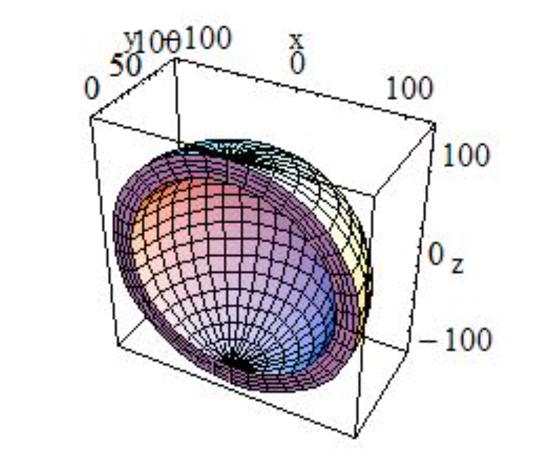

#############
GEMC Detector
#############

Detector Definition
-------------------

A detector in gemc is defined by attributes such as name, mother volume name, type, etc.
A gemc detector will translate into geant4 solid, logical and physical volume. It can be passive or active.
It can have a magnetic field.

Detector Attributes
-------------------

The list of the gemc detector attributes is given in the table below.

=====================  ===================== ================================================================================================
Variable Name             type                                          Description
---------------------  --------------------- ------------------------------------------------------------------------------------------------
name                     string               Name. Cannot contain spaces.
mother                   string               Name of the mother. Mother volume must exist.
description              string               Description.
pos                      G4ThreeVector        Position in respect to the mother reference system.
rot                      G4RotationMatrix     Rotation in respect to the mother reference system.
color                    rrggbb(t)            2 hexa numbers for each R, G, B color. Optional 7th number: transparency.
type                     string               Geant4 solid type.
dimensions               vector<double>       Geant4 solid dimensions (with units when necessary).
material                 string               Material name.
magfield                 string               Field name. "no" if the field is absent or inherited from the mother volume.
ncopy                    int                  copy number
pMany                    bool                 currently not used
exist                    int                  on/off switch (0/1)
visible                  int                  visibility of the detector: 0=invisible 1=visible
style                    int                  style: 0=wireframe 1=solid
sensitivity              string               name of the hit collection (define the output bank)
hitType                  string               name of the hit process routine
identity                 vector<identifier>   Example: superlayer manual 1 segment manual 3 strip manual 4
=====================  ===================== ================================================================================================

More details are given below.

Detector type, dimensions
-------------------------
The detector type corresponds to the geant4 solid type. Its dimensions correspond
to the geant4 constructor arguments [#]_ [#]_, in their order. The complete list
of geant4 solid can be found
`here <http://geant4.web.cern.ch/geant4/UserDocumentation/UsersGuides/ForApplicationDeveloper/html/ch04.html#sect.Geom.Solid>`_.

For example, to define a sphere the G4Sphere can be used. Its geant4 parameters are::

 G4double   pRmin,
 G4double   pRmax,
 G4double   pSPhi,
 G4double   pDPhi,
 G4double   pSTheta,
 G4double   pDTheta

so the gemc definition::

 "100*cm 120*cm 0*deg 180*deg 0*deg 180*deg"

would build the geant4 sphere:

corresponding to::

 pRmin=100, pRmax=120, pSPhi=0*Degree, pDPhi=180*Degree, pSTheta=0*Degree, pDTheta=180*Degree

Rotations
---------
The rotation of a volume is an ordered set of rotation around each axis. The reference frame is the detector mother's.

The default rotation order is xyz, so that the following will rotate the detector first around x, then y then z by 10, 30,
and 50 degrees respectively::

 "10*deg 30*deg 50*deg"

To change the order of rotation the "ordered" directive can be used. For example, to rotate around z first, then x then y::

 "ordered: zxy 10*deg 30*deg 50*deg"

Color, Transparency
-------------------
The visual attributes of color and transparency can be set with a string of 6 or 7 numbers.
The first 6 numbers are in the form rrggbb where rr, gg, bb are numbers (in hexadecimal) from 0 to 255
controlling the intensite of red, green, and blue respectively.

For example a green detector would have::

 "00ff00"

An optional 7th digit could be added to set the transparency. The number goes from 0 to 5 with 5 setting the detector to
fully transparent and 0 being fully opaque.

For example a red semi-transparent detector would have::

"ff00002"

|

.. rubric:: Footnotes

.. [#] The number of dimensions must match the geant4 constructor.
.. [#] All numbers must have units (even zeros). If a number is a count, "counts" can be used as unit, i.e. "10*counts".

