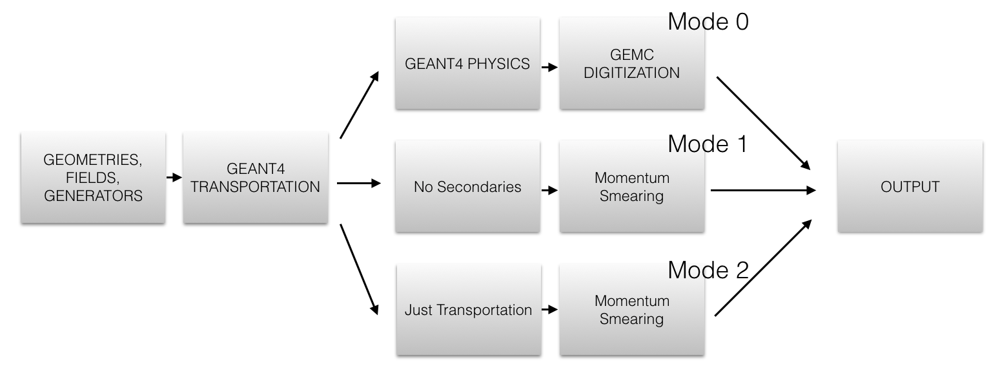

############
FAST MC Mode
############

.. _fastMCMode:

By turning off some or all physics processes a significant speed factor is gained in processing events.

A FASTMCMODE flag is introduced to take advantage of this. A user defined smearing routine is introduced in the hitprocess factory
so that particles information can be smeared.

By default the momentum is not smeared. To smear, the routine::

 G4ThreeVector psmear(G4ThreeVector p)

can be implemented in the hitProcess factory.

|

   Figure 1: Mode 0 is the full geant4 simulation. Mode 1 turns off secondaries. Mode 2 turns off all physics except transportation.

|

The modes are as follows (see Figure 1):

a. Mode 0: Full geant4 simulation
b. Mode 1: Turns off secondaries production. Energy loss is still computed, the would-be secondaries just dump all their energy at their
   producion vertex. All hit process routines are disabled.
c. Mode 2: Turns off all physics except transportation. No energy loss. Force detection of particles passing through detectors.
   All hit process routines are disabled.
d. Mode 10: Same as mode 1 but with process routines enabled.
e. Mode 20: Same as mode 2 but with process routines enabled.

In both modes 1 and 2 the field transportation is made faster (by using G4SimpleRunge integration method), and hits are not digitized.

Output
------

The output is collected in the generated bank information. The number of hits, smeared and unsmeared momentum is among the quantities saved.
Notice that for mode 1 the unsmeared momentum could differ from the original generated momentum because the track could still lose energy
in passive material.

As an example, the detector "dc" psmear routine increases px by 1 MeV. The resulting output for one particle looks like::

 --- Generated Particles Bank --
  - Particle 1 pid: 11   -  mom: (391.597,-1100.79,3825.56) MeV   -  vert: (0,0,0) mm
  - Hit >dc< Has 0 hit with nphe 1 nphe and time -1 ns
    orig     mom: (391.538, -1096.99, 3821.49)
    smeared  mom: (392.538, -1096.99, 3821.49)
  - Hit >ftof< Has 0 hit with nphe 1 nphe and time -1 ns
    orig     mom: (336.35, -946.503, 3306.99)
    smeared  mom: (336.35, -946.503, 3306.99)
  - Hit >htcc< Has 0 hit with nphe 180 nphe and time -1 ns
    orig     mom: (1.09772e-06, -4.24849e-06, -3.77395e-06)
    smeared  mom: (1.09772e-06, -4.24849e-06, -3.77395e-06)
  - Hit >pcal< Has 0 hit with nphe 3 nphe and time -1 ns
    orig     mom: (120.305, -305.377, 1105.12)
    smeared  mom: (120.305, -305.377, 1105.12)
 --- End of Generated Particles Bank --

Performance
-----------

Below is the benchmars for running 200 events within CLAS12, a full-fledge detector made up with two indipendent magnetic fields, two Cherenkov detectors,
several panels of Time-Of-Flights, a tracker and three calorimeters.

- Mode 0: 99 seconds
- Mode 1: 11 seconds
- Mode 2: ~ 0.5 seconds.

Thus mode 1 gives a factor of ~10X in speed and mode 2 a factor of ~200X.

