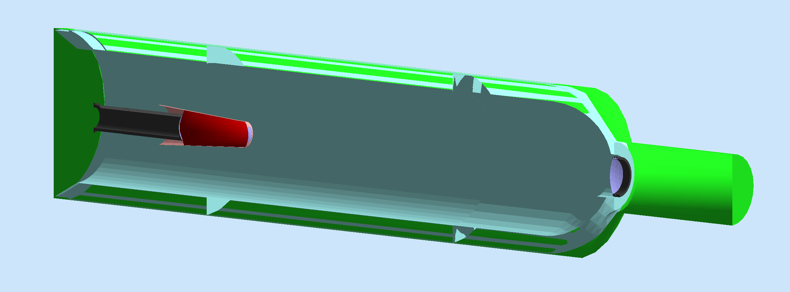
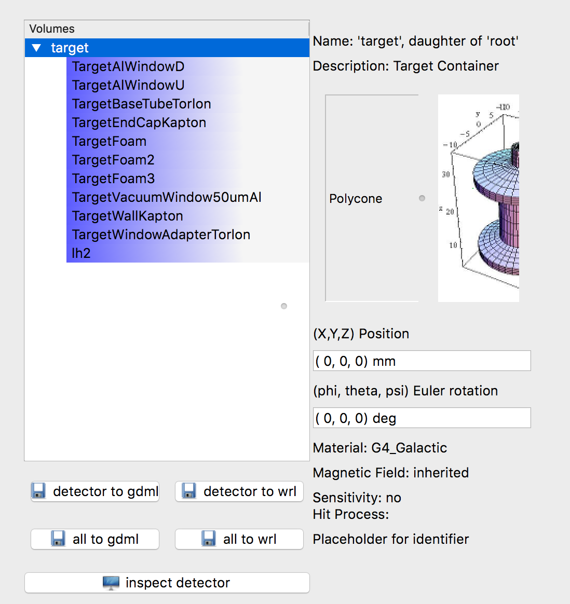

.. stl files can be viewed by using the github viewer. Doc is here: https://help.github.com/articles/3d-file-viewer/

######################
GDML and CAD Factories
######################

.. _gdmlCadFactories:


Importing GDML and CAD models in gemc
-------------------------------------

gemc can import models in GDML [#]_ format or directly from CAD models [#]_.


For example, to import three detectors:

 - one in the usual TEXT format, named "drift_chambers"
 - one in GDML, named "target" (filename is target.gdml)
 - one in CAD, named "beamline" (filename is target.stl or target.ply)

you would add the following lines in the gcard::

 <detector name="drift_chambers" factory="TEXT" variation="lH2"/>
 <detector name="target" factory="GDML"/>
 <detector name="beamline" factory="CAD"/>

Notice you do not need the variation tag for the GDML and CAD detector factories.
If you import the models in this way, you will not be able to assign attributes to them.

Importing CAD models from a directory
-------------------------------------

A single directory can be specified in the gcard. GEMC will look for and load all valid CAD files inside that directory.
For example::

 <detector name="beamline/" factory="CAD"/>

will load all CAD files inside "beamline".
Only files with these extensions will be loaded: ".stl" or ".ply" or ".obj". Any other format will be ignored.

GEMC attributes to models
--------------------------

Attributes can be assigned when models are imported from a directory. This includes:

 - material
 - visualization attributes (color, surface style)
 - sensitivity
 - shifts and tilts relative to volume
 - mother volume

Attributes are assigned by using an XML file "cad.gxml" inside the directory dedicated to the models.
For example the following line in a cad.gxml inside the directory "beamline" will change
the color, material of an imported volume named "vacuumLine" and assign flux sensitivity so that hits can be recorded::

 <volume name="vacuumLine" mother="target" color="99ff00" material="G4_Pb"  position="0*mm 0*mm 1273.27*mm" sensitivity="flux" hitType="flux"  identifiers="id manual 1"/>


CAD vs GDML Attributes
----------------------

- A GDML file can contain many volumes. Their attributes are assigned by a .gxml file with the same name as the system.
  For example, to set the attributes of the target of the gcard above, a filename *"target.gxml"* can be used::

   <gxml>
		<volume name="inner_target_vol" color="8899dd" material="lH2"/>
   </gxml>

- A CAD file contains only one volume. Many cad files can be imported and the attributes of all of them can
  be set by filename *"cad.gxml"*"::

   <gxml>
		<volume name="beamline" color="8899dd" material="G4_Al"/>
   </gxml>


|

CAD Examples
------------

.. raw:: html

	<script src="https://embed.github.com/view/3d/gemc/detectors/master/forFun/cad/enterprise.stl?height=300&width=300"></script>
	<script src="https://embed.github.com/view/3d/gemc/detectors/master/forFun/cad/dragon.stl?height=300&width=300"></script>


You can find many autocad examples `here <http://www.thingiverse.com/search/>`_.

|

Step to Mesh with FreeCad
-------------------------

Most autocad software can export models directly in the mesh format needed (STL, PLY or OBJ).
If that's not possible you can use Freecad [#]_ to convert step objects to stl format. Here are the steps:

1. Change the View > Workbench > Mesh Design
2. Select the object
3. Click on Meshes > Create Mesh From Shape
4. Select precision desired - click OK
5. Click on the new meshed object and File > Export  to a STL file (or PLY or OBJ).

|

Notes on importing CAD volumes in GEMC
--------------------------------------

1. The tessellation process describe above preserves the volume placement coordinates. The coordinate specified in the GXML file are
   shifts and tilts relative to volume. For example, if a volume in the model is placed at (0,0,10)mm, a GXML entry ```position="0*mm 0*mm 10*mm"```
   will place the volume at (0,0,20)mm.
2. It is generally a good idea to create a "mother volume" to place the STL file into, instead of the default value that is "root". This will
   keep the hierarchy well organize. For example, the CLAS12 target is placed inside a polycone to encapsulate it completely, see figures below.






|

.. rubric:: Footnotes

.. [#] Geometry Description Markup Language. It's an application independent geometry description based on XML. See `gdml at cern <http://gdml.web.cern.ch/GDML>`_.
.. [#] STL (`STereoLithography <https://en.wikipedia.org/wiki/STL_(file_format)>`_),
   PLY (`Standard Polygon Format <https://en.wikipedia.org/wiki/PLY_%28file_format%29>`_),
   OBJ (`Alias Waveform Object <https://en.wikipedia.org/wiki/Wavefront_.obj_file>`_) file formats are available.
.. [#] http://www.freecadweb.org
