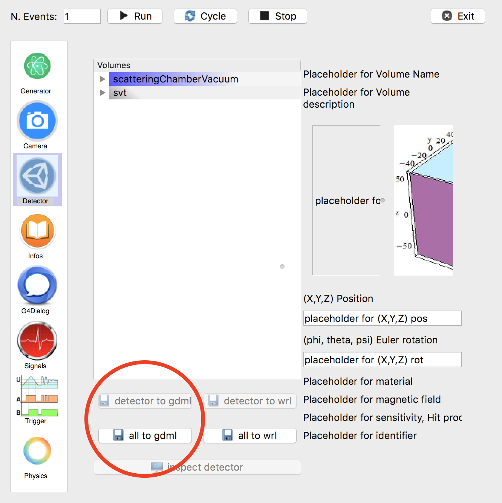

.. stl files can be viewed by using the github viewer. Doc is here: https://help.github.com/articles/3d-file-viewer/

##################
GEMC and ROOT TGeo
##################

.. _gemcTgeo:

GEMC geometry to ROOT
---------------------

The geometry loaded in GEMC can be exported to a root file into TGeo objects.

Using the GUI, first save it to the GDML format by clicking the "to gdml" button:

|

Then inside root you can  [#]_, [#]_:

1. load it::

    TGeoManager *geom = TGeoManager::Import("root.gdml")

2. visualize it::

	 geom->GetTopVolume()->Draw("ogl")

3. save it to a ROOT file::

	 TFile f("geo.root", "RECREATE")
	 geom->Write()

You can then use various ROOT tools to navigate it, for example a TBrowser or the `TGeoManager <https://root.cern.ch/doc/v612/classTGeoManager.html>`_.

|

.. rubric:: Footnotes

.. [#] See `gdml at cern <http://gdml.web.cern.ch/GDML>`_.
.. [#] `ROOT GDML Tools <https://root.cern.ch/doc/v614/group__Geometry__gdml.html>`_.
