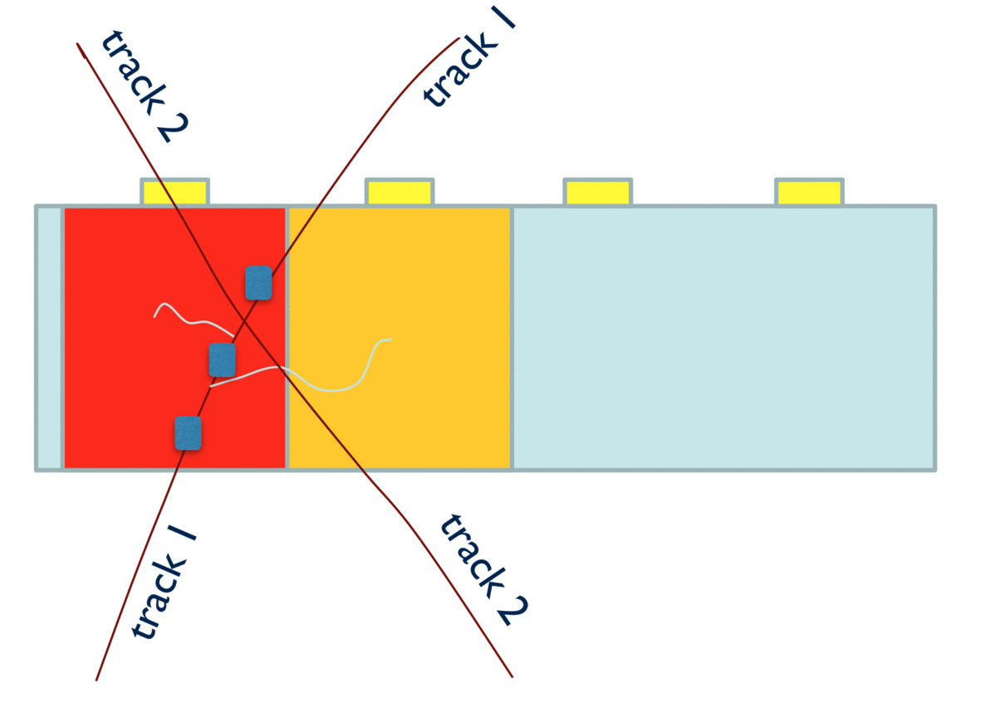

########
GEMC Hit
########

Hit Definition
--------------

The definition of a hit is tied up to the detector electronics, in particular its Time Window (TW), defined by the user.

All geant4 steps [#]_ in a detector element [#]_ within the TW constitute a hit.

Example
-------

Shown in Fig. 1 is a schematic
of two tracks and secondaries hitting two detector elements to better illustrate the hit definition. In particular:

* Track 1 has 3 (blue) steps in the first red cell and one (purple) step in the second yellow cell.
* Track 1 also has two secondaries; the first one has one step in the red cell and the second one has two steps, one in each cell.
* Track 2 has 2 steps in each cell, within the TW of the previous steps. So its steps do not create new hits, but add to the previous
  hits' steps.
* All the blue steps happens within the detector TW: they constitute one hit.
* All the purple steps happens within the detector TW: they constitute one hit.
* In total, we have two hits. Notice that if the second track was out of the TW, it would generate two additional hits, with two steps each
  in each cell.

   Figure 1: the first track generate two hits. The second track is within the TW of the first one, so it does not generate additional hits and
   its steps add to the previous hits’ steps.

True Information
----------------

The true information for any system *systemname* can be written in the output
by using the *INTEGRATEDRAW* option. For example, to record true information for the system *dc*:

.. code-block:: bash

	<option name="INTEGRATEDRAW" value="dc"/>

By default *INTEGRATEDRAW* is disabled.

The option *SAVE_ALL_MOTHERS* can be used to enable the storing of mother particle information [#]_ .

The complete lise of all the variable is given in the table below.
For quantities that can be integrated, the variable is either an average or the weighted
sum of the quantity.
For quantities such as pid where no integration makes sense, the value refers to the *the
first particle entering the sensitive volume*, or *FP* in the table.

=====================  ========= ================================================================================================
Variable Name             ID                                          Description
---------------------  --------- ------------------------------------------------------------------------------------------------
pid                       1       ID of the FP [#]_
mpid                      2       ID of the mother of the FP
tid                       3       Track ID of the FP
mtid                      4       Track ID of the mother of the FP (if enabled)
otid                      5       Track ID of the ancestor that generated the FP (if enabled)
trackE                    6       Total energy of the FP
totEdep                   7       Total energy deposited (in MeV)
avg_x                     8       Average X position in the global reference system (in mm)
avg_y                     9       Average Y position in the global reference system
avg_z                     10      Average Z position in the global reference system
avg_lx                    11      Average X position in the local reference system 
avg_ly                    12      Average Y position in the local reference system
avg_lz                    13      Average Z position in the local reference system
px                        14      x component of momentum of the FP (in MeV)
py                        15      y component of momentum of the FP
pz                        16      z component of momentum of the FP
vx                        17      x component of the FP's point of origin (in mm)
vy                        18      y component of the FP's point of origin
vz                        19      z component of the FP's point of origin
mvx                       20      x component of the FP mother's point of origin (if enabled)
mvy                       21      y component of the FP mother's point of origin
mvz                       22      z component of the FP mother's point of origin
avg_t                     23      Average time
nsteps                    24      Number of geant4 steps
procID                    25      Process that created the FP. See section below.
hitn                      99      Hit ID
=====================  ========= ================================================================================================

Process Names / ID Table
------------------------

The link between process name and the procID variable stored in the true information bank is given in the
table below.

   =====================  =========
   Process Name           ID (int)
   ---------------------  ---------
   e ionization              1
   compton scattering        2
   e bremsstrahlung          3
   Photo Electric Effect     4
   Gamma Conversion          5
   e+ Annihilation           6
   photon-Nuclear            7
   electron-Nuclear          8
   Hadronic Elastic          9
   Proton Inelast ic         10
   Neutron Inelastic         11
   pi- Inelastic             12
   pi+ Inelastic             13
   hadron ionization         14
   neutron capture           15
   decay                     16
   muon ionization           17
   Coulomb Scattering        18
   Cherenkov                 19
	deuteron Inelastic        20
   na                        90
   =====================  =========

|

.. rubric:: Footnotes

.. [#] Geant4 determines the size of a step, and the energy deposited, based on particle type, momentum,
       material type and density, and physics processes cross sections.
       In GEMC users can limit the maximum step for a given detector.
.. [#] A detector element is its smallest readout. For example, a wire in a drift chamber, or a strip in a silicon tracker.
.. [#] Note: SAVE_ALL_MOTHERS will force a loop on all the existing tracks. Do not use if you have hundreds of tracks in one event as it will
       slow down the simulation.
.. [#] FP: the first particle entering the sensitive volume

