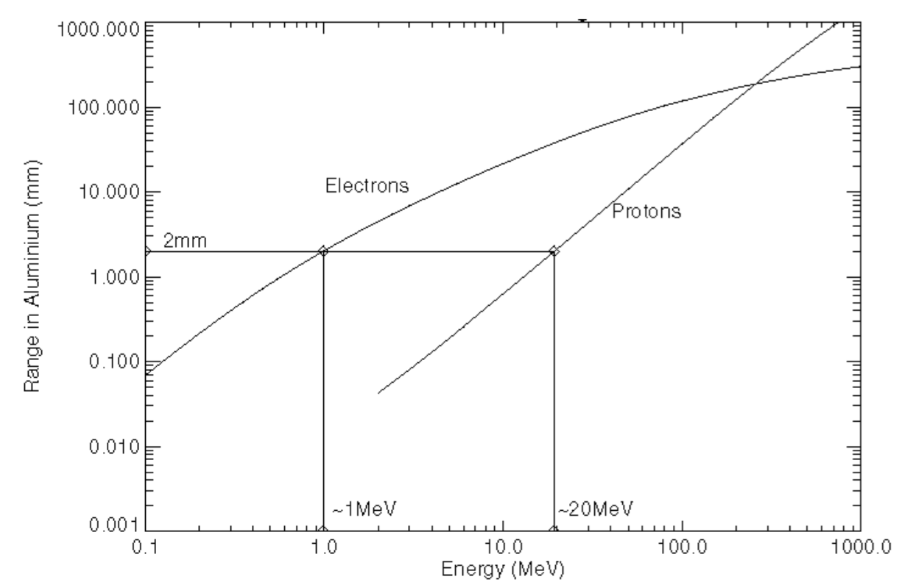

########
GEMC Hit
########

.. _hitDefinition:

Hit Definition
--------------

The definition of a hit is tied up to the detector electronics, in particular its Time Window (TW), defined by the user.

All geant4 steps [#]_ in a detector element [#]_ within the TW constitute a hit.

Example
-------

Shown in Fig. 1 is a schematic
of two tracks and secondaries hitting two detector elements to better illustrate the hit definition. In particular:

* Track 1 has 3 (blue) steps in the first red cell and one (purple) step in the second yellow cell.
* Track 1 also has two secondaries; the first one has one step in the red cell and the second one has two steps, one in each cell.
* Track 2 has 2 steps in each cell, within the TW of the previous steps. So its steps do not create new hits, but add to the previous
  hits' steps.
* All the blue steps happens within the detector TW: they constitute one hit.
* All the purple steps happens within the detector TW: they constitute one hit.
* In total, we have two hits. Notice that if the second track was out of the TW, it would generate two additional hits, with two steps each
  in each cell.

.. figure:: hitDefinition.gif
   :width: 90%
   :align: center

   Figure 1: the first track generate two hits. The second track is within the TW of the first one, so it does not generate additional hits and
   its steps add to the previous hits’ steps.

Notice that lowering a production threshold may not affect the number of hits: there may be more secondaries produced, but these steps may all happen
within the same timewindow, thus collecting in the same hit.

True Information
----------------

The true information for any system *systemname* can be written in the output
by using the *INTEGRATEDRAW* option. For example, to record true information for the system *dc*:

.. code-block:: bash

	<option name="INTEGRATEDRAW" value="dc"/>

By default *INTEGRATEDRAW* is disabled.

The option *SAVE_ALL_MOTHERS* can be used to enable the storing of mother particle information [#]_ .

The complete list of all the variable is given in the table below.
For quantities that can be integrated, the variable is either an average or the weighted
sum of the quantity.
For quantities such as *pid* where the integration does not make sense, the value refers to the *the
first particle entering the sensitive volume*, or *FP* in the table.

=====================  ========= ================================================================================================
Variable Name             ID                                          Description
---------------------  --------- ------------------------------------------------------------------------------------------------
pid                       1       ID of the FP [#]_
mpid                      2       ID of the mother of the FP
tid                       3       Track ID of the FP
mtid                      4       Track ID of the mother of the FP (if enabled)
otid                      5       Track ID of the ancestor that generated the FP (if enabled)
trackE                    6       Total energy of the FP
totEdep                   7       Total energy deposited (in MeV)
avg_x                     8       Average X position in the global reference system (in mm)
avg_y                     9       Average Y position in the global reference system
avg_z                     10      Average Z position in the global reference system
avg_lx                    11      Average X position in the local reference system 
avg_ly                    12      Average Y position in the local reference system
avg_lz                    13      Average Z position in the local reference system
px                        14      x component of momentum of the FP (in MeV)
py                        15      y component of momentum of the FP
pz                        16      z component of momentum of the FP
vx                        17      x component of the FP's point of origin (in mm)
vy                        18      y component of the FP's point of origin
vz                        19      z component of the FP's point of origin
mvx                       20      x component of the FP mother's point of origin (if enabled)
mvy                       21      y component of the FP mother's point of origin
mvz                       22      z component of the FP mother's point of origin
avg_t                     23      Average time
nsteps                    24      Number of geant4 steps
procID                    25      Process that created the FP. See section below.
hitn                      99      Hit ID
=====================  ========= ================================================================================================

.. _productionThreshold:

Production Threshold
--------------------

Every simulation developer must answer the questions:

- how low can you go?
- at what energy do I stop tracking particles?

This is a balancing act:

- need to go lowe enough to capture the physics of interest
- cannot go too low: some processes have infrared divergence

In *geant3* this balance was addressed by imposing an absolute cutoff in energy: particles are
stopped when this energy is reached, and the remaining energy is dumped at that point.

This leads to large inaccuracies in location: there is a particle type, momentum and material dependance of
the distance travelled by particles. A 10 KeV cutoff in lead is very different than a 10 KeV cutoff
in a scintillator.

Definition
==========

in *geant4* **the production threshold is a distance**, not an energy:

- if secondaries can travel more than that distance, they are produced.
- otherwise there is discrete energy loss.

The location is now correct. Onlt one value of threshold is needed for all materials.

Example: 10mm vs 1mm vs 0.1mm
=============================

Let's consider a box of aluminum, an electron passing through it for 3 different production thresholds pth:

- pth=10mm: only secondary electrons of ~5 Mev or higher will be produced.
- pth=1mm: only secondary electrons of ~700 ev or higher will be produced.
- pth=0.1mm: only secondary electrons of ~150 ev or higher will be produced.

Depending on the e.m. physics list precision, pth=0.1mm could yield same resulsts as pth=1mm:
if the threshold is smaller than free range path of a particle, lowering won't affect results.

*Mean ranges of protons and electrons in aluminum [Source: E.J. Daly, A.Hilgers, G. Drolshagen, and H.D.R. Evans, "Space Environment Analysis: Experience and Trends,"
ESA 1996 Symposium on Environment Modelling for Space-based Applications, Sept. 18-20, 1996, ESTEC, Noordwijk, The Netherlands.]*

.. _fluxDetector:

FLUX Detector
-------------
A FLUX detector is a special case of sensitive detector. The hit definition for FLUX is different than :ref:`the one above <hitDefinition>`:

 - different tracks will produce different hits, independently of their time.

In the same detector element, all steps of the same truck will form one "integrated hit".

In the FLUX detector, each particle produced will then produce a separate hit (thus the name *FLUX*), while in normal sensitive detectors all
particles within the same electronic timewindow will collect in one hit.

Setting FLUX detectors in GEMC
==============================

In GEMC we can have an arbitrary number of FLUX detector. Their ID is set as follows::

 $detector{"identifiers"}  = "id manual 3";

The "id" variable is part of the true information in the output.

.. _processCatalogue:

Process Names / ID Table
------------------------

The link between process name and the procID variable stored in the true information bank is given in the
table below.

   =======================  =========
   Process Name             ID (int)
   -----------------------  ---------
   e ionization              1
   compton scattering        2
   e bremsstrahlung          3
   Photo Electric Effect     4
   Gamma Conversion          5
   e+ Annihilation           6
   photon-Nuclear            7
   electron-Nuclear          8
   positron-Nuclear          9
   Coulomb Scattering        10
   Cherenkov                 11
   Hadronic Elastic          20
   Hadronic bremsstrahlung   21
   Hadron ionization         22
   Hadron pair production    23
   Proton Inelastic          30
   Neutron Inelastic         31
   Neutron capture           32
   pi- Inelastic             40
   pi+ Inelastic             41
   Decay                     50
   Decay With Spin           51
   muon ionization           60
   muon pair production      61
   muon bremsstrahlung       62
   muon nuclear              63
   kaon- Inelastic           70
   kaon+ Inelastic           71
   kaon0 Inelastic           72
   kaon0L Inelastic          73
   kaon0S Inelastic          74
   alpha Inelastic           80
   lambda Inelastic          90
   sigma- Inelastic          100
   deuteron Inelastic        110
   ion ionization            120
   triton Inelastic          130
   na                        90
   =======================  =========

|

.. rubric:: Footnotes

.. [#] Geant4 determines the size of a step, and the energy deposited, based on particle type, momentum,
       material type and density, and physics processes cross sections.
       In GEMC users can limit the maximum step for a given detector.
.. [#] A detector element is its smallest readout. For example, a wire in a drift chamber, or a strip in a silicon tracker.
.. [#] Note: SAVE_ALL_MOTHERS will force a loop on all the existing tracks. Do not use if you have hundreds of tracks in one event as it will
       slow down the simulation.
.. [#] FP: the first particle entering the sensitive volume

