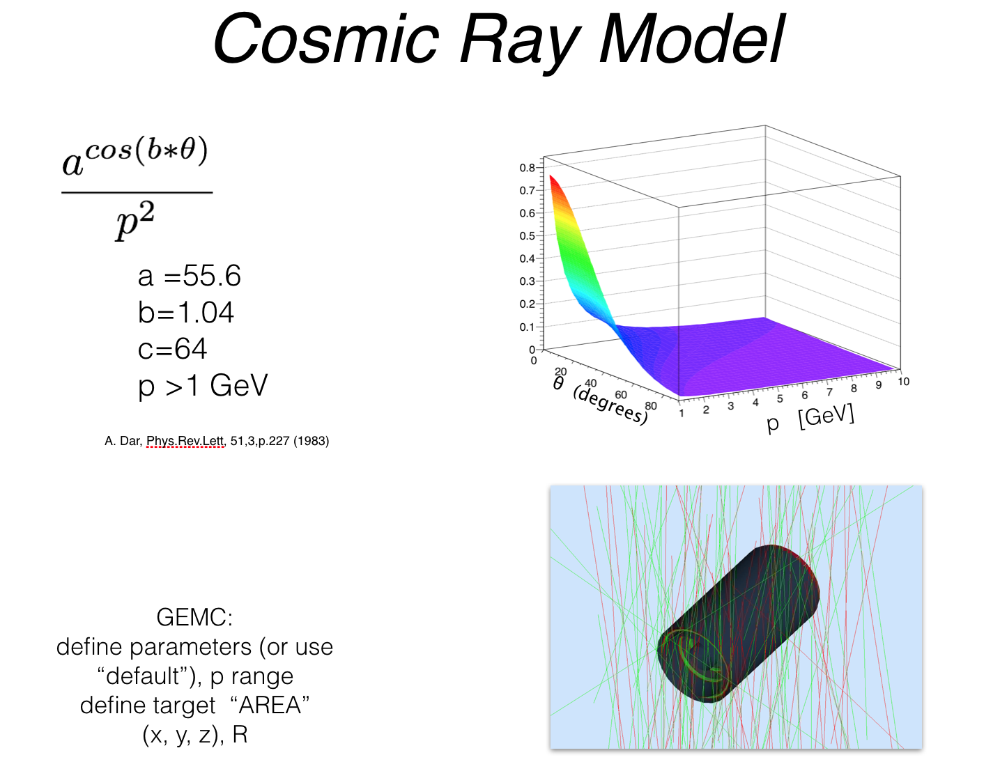

:orphan:

.. _2.3:

###########
Release 2.3
###########

- added scintillation in the material definition, both in API and in the gemc core.
  The number of photons emitted has two component (fast and slow) and is proportional two::

   A e^(-t/tfast) + B e ^(-t/tslow)

  where A and B are the fast and slow component respectively and are dependent on wavelength,
  and tfast and tslow are the fast and slow time constant (valid for all wavelengths).

  The following quantities can now be specified in the material API, and will be read by gemc.

   * fastcomponent: vector (wavelength)
   * slowcomponent: vector (wavelength)
   * scintillationyield: number of photons / MeV
   * resolutionscale: scale to control the resolution (multiplies sqrt(N))
   * fasttimeconstant: fast time constant
   * slowtimeconstant: slow time constant
   * yieldratio: relative strength of the fast component
   * rayleigh scattering

- setting hadronic physics list to "none" by default. User can enable them in the gcard or
  command line. This way one can choose to run w/o hadronic physics.

- added RUN_WEIGHTS option. The argument is a text file with two columns: run number and its luminosity
  weight. GEMC will distribute the number of events requested among the run list according to their weight.
  The calibration constants, including status, are re-read from the user databases at each run number change.

 .. image:: lumiWeight.png
 	 :width: 90%
	 :align: center

 - production cut will now affect all volumes in a system rather than just the sensitive volumes

 - time resolution is an external parameter "VTRESOLUTION"

 - added bunch sampling of the voltage vs signal time. Data structure name is quantumS, map<int, int>.
   This is effectively FADC mode 1.
 - added graphing of the FADC signal. The shape and intensity of the signal should be optimized for each detector
 - trigger signal added to hit
 - display of trigger added to trigger gui
 - dropdown menu to decide to plot voltage, trigger, or both

 - added COSMICRAYS option, small utility macro to show the distribution

|

For the complete list of all changes please visit the `changelog <documentation/releases/changelog.html>`_.

