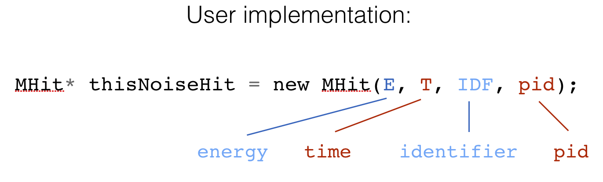
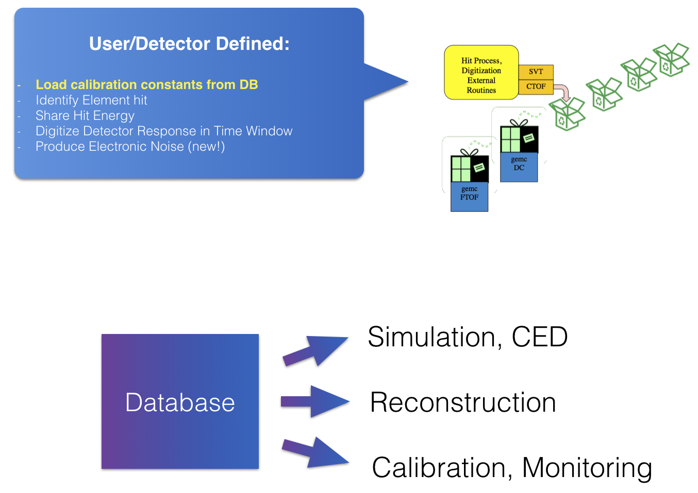
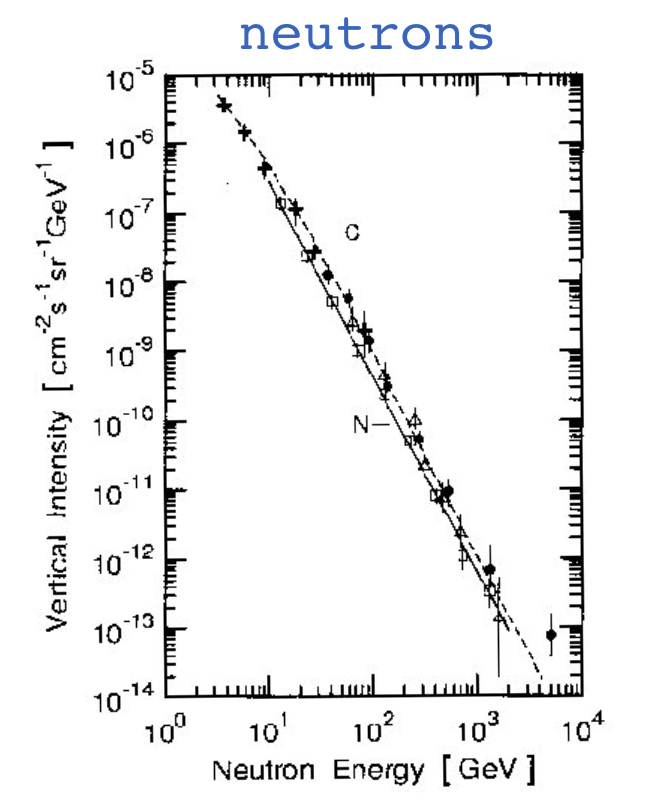
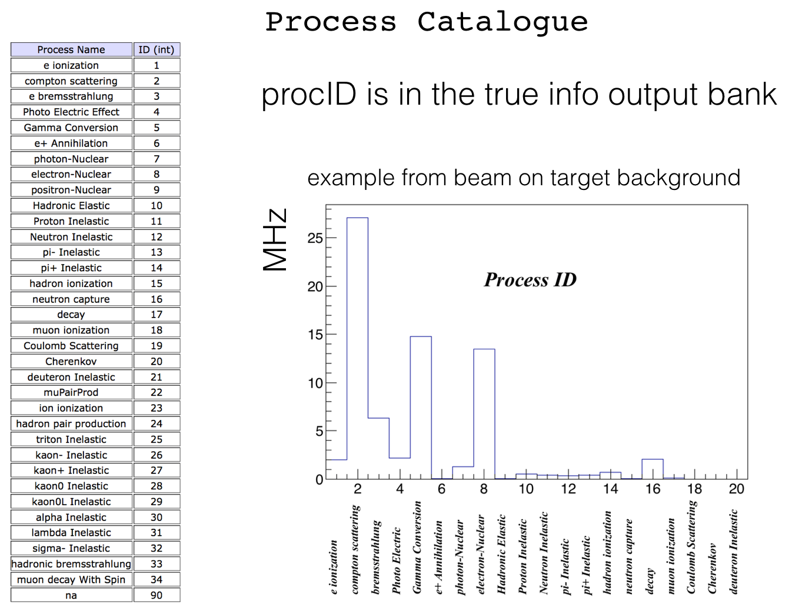

:orphan:

.. _2.4:

###########
Release 2.4
###########

Electronic Noise
----------------

A new pure virtual function vector<MHit*> electronicNoise() is added to the hit process routine methods
to generate electronic noise / hot channels.

Electronic noise hits are added to the normal geant4 hits. Each process routine will have them available in the output.

In its implementation users can instantiate an arbitrary number of hits as shown in the figure below.

|

Database Mechanism in Digitizaton
---------------------------------

The hit process routines are user defined, external routines where the user can:

- identify the element that was hit
- share energy between elements (typically nearest neighbor)
- digitize detector response
- produce electronic noise

A new mechanism as been added to load detector specific constants from a database. These are typically geometry calibration constants
that can be used by the reconstructions, monitoring and visualization mechanism.

|

Field Properties
----------------

The following quantities can now be defined by options / gcard:

- Mapped field minimum step
- Field integration method.
- Field interpolation method.

Available Integration Methods:

- G4CashKarpRKF45: Fifth Order Range Kutta, for very smooth fields.
- G4ClassicalRK4: Fourth Order Range Kutta. Robust for every field.
- G4SimpleHeum: Third order stepper.
- G4SimpleRunge: Simplified (second order) Range Kutta (faster).
- G4ImplicitEuler: Second order stepper, for faster varying fields.
- G4ExplicitEuler: First order stepper, for rough fields.
- G4HelixImplicitEuler: Second order, specialized for helix-like trajectories.
- G4HelixExplicitEuler: First order, specialized for helix-like trajectories.
- G4HelixSimpleRunge: Second order Range Kutta, specialized for helix-like trajectories.
- G4NystromRK4: provides accuracy near that of G4ClassicalRK4 with a significantly reduced cost in field evaluation.

Available Interpolation Methods:

- none: closest grid point.
- linear: linear interpolation (new, now is default)

Neutron Cosmic Rays
-------------------
The COSMICRAYS option now accept an additional, optional argument:

- muon: default behavior, generate muons as before
- neutron: generate neutrons with energy and angle dependencies given by *Heidbreder et al., J. Geophys. Pres. 76, 2905 (1971)*

This work was performed by Alessandra Filippi.

Material, Sensitivity Options
-----------------------------

Two additional options can switch material::

 - CHANGEVOLUMEMATERIALTO to change a volume material:
   Usage: -CHANGEVOLUMEMATERIALTO="volume, new material"

 - SWITCH_MATERIALTO to change a material into another:\n
   Usage: -SWITCH_MATERIALTO="oldmaterial, newmaterial"

Both CHANGEVOLUMEMATERIALTO and SWITCH_MATERIALTO can be repeated.

In addition::

 - REMOVESENSITIVITY can be used to remove a volume sensitivity:
   Usage: -REMOVESENSITIVITY="volumename1, volumename2, ..."

Process Catalogue
-----------------

A procID variable has been added to the true information banks.
This is the physical process that generated the particle.
A value of 90 is given to the "transportation" process (i.e. if the particle was a primary particle).

|

For the complete list of all changes please visit the `changelog <../changelog.html>`_.

