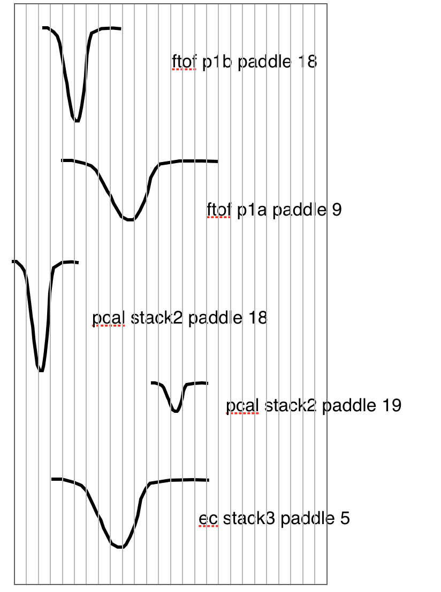
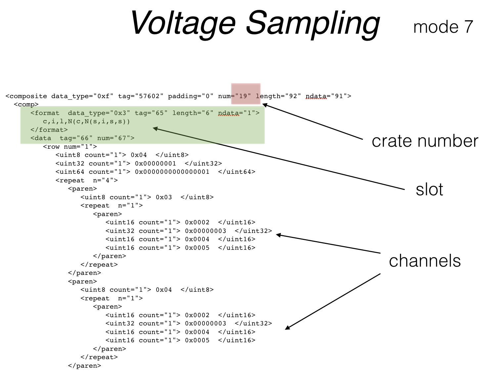

:orphan:

.. _2.5:

###########
Release 2.5
###########

MLibrary
--------

The mlibrary is a collection of highly optimized, specialized
stand-alone c++ 11 libraries that fashion gemc into a object oriented framework.

Some functionality of gemc 2.X is being replaced by these libraries. Others are being prepared
for release 3.0.

The documentation for the mlibrary can be found :ref:`here <mlibrary>`.

CAD and GDML Libraries
----------------------

gemc can now import models in GDML format or directly from CAD models.

For example, to import three detectors:

- one in the usual TEXT format, named "drift_chambers"
- one in GDML, named "target" (filename is target.gdml)
- one in CAD, named "beamline" (filename is target.stl or target.ply)

you would add the following lines in the gcard::

<detector name="drift_chambers" factory="TEXT" variation="lH2"/>
<detector name="target" factory="GDML"/>
<detector name="beamline" factory="CAD"/>

Notice you do not need the variation tag for the GDML and CAD detector factories.

Attributes such as materials, positioning, rotation, sensitivity can be assigned at run time
using xml files.

.. container:: mydiv

	.. thumbnail:: ctof.png
		:width: 53%
		:group: mycenter
		:title:

		The clas12 ctof scintillator and light guides. .

	.. thumbnail:: ../../../examples/humanBody.png
		:width: 40%
		:group: mycenter
		:title:

		The digestive system - the lower gastro-intenstinal track is made sensitive and records particles passage.

	.. thumbnail:: beamline.png
		:width: 93%
		:group: mycenter
		:title:

		The clas12 beamline shielding and support. The model is imported directly from the JLab engineering group.

Vertex Distribution
-------------------

New option added to SPREAD_V:

- "gauss": spread quantities with a gaussian distribution
- "flat": default. spread quantities with a flat distribution.

For example::

 -SPREAD_V="(1, 5)cm gauss"

will spread the vertex with a gaussian distribution sigma of 1cm around r and 5 cm around z.

Particle vertices can be spread along "r" and "φ" or along the cartesian coordinate "x", "y", "z". To select, set SPREAD_V to:

- ( number, number ) unit : selects (r, φ) spread
- ( number, number, number ) unit : selects (dx, dy, dz) spread

This changes are backward compatible.

No more hardcoded cpp materials
-------------------------------

All the hardcoded material definitions have been deprecated and moved to the API definitions (external database).

Accelerator Sync Bank
---------------------

Accelerator sync information can now be produced and saved in the output stream thanks
to the :ref:`frequencySyncSignal` mlibrary.

A sync signal is generated a random number N of bunches away from the event start time.
The signal is repeated forward and backward in time, every :math:`N_{RF}\delta t` seconds, until the
event electronic time window is filled.

The situation is explained in the figure below.

.. image:: ../../../mlibrary/rftime.png
	:width: 90%
	:align: center

An arbitrary number of sync signal can be generated by givin their time distance away from each other.

The option **RFSETUP** is used to control the sync signal.
For example, to set the accelerator radio frequency to 500MHz (0.5 GHz) and produce two RF signal,
30 ns away from each other, each every 80ns::

 -RFSETUP="0.5, 80, 30"

Translation tables
------------------

The hit process routines can now use the :ref:`translation table mlibrary <translationTable>`.

gstring namespace
-----------------

The :ref:`gstring` is a mlibrary with various string utilities.

User defined charge/time
------------------------

A chargeTime routine can now be used to produces charge and time information
for each geant4 step. This is meant to be information as it will be seen by the electronics.

User defined V(t)
-----------------

The chargeTime information can be converted to a voltage versus time function that now
can be completely customized by users in each hit process routine.

The customization includes:

- shape of the signal
- time delay

JLAB FADC Composite banks
-------------------------

The composite banks represent the new output format produced by flash ADC electronics.
The output is organized by crate, and within each crate by slot. The transformation
from detector identifier to crate/slot/channel
is provided by the :ref:`translation table mlibrary <translationTable>`.

The output can be:

- sampled signals of the V(t) output
- integrated value of the V(t) signal, with associated time.

With this change the gemc simulation can be rendered virtually indistinguishable from
real data: the data is in the same format, with signal described by crate/slot/channel
identifiers.

|

For the complete list of all changes please visit the `changelog <../changelog.html>`_.

