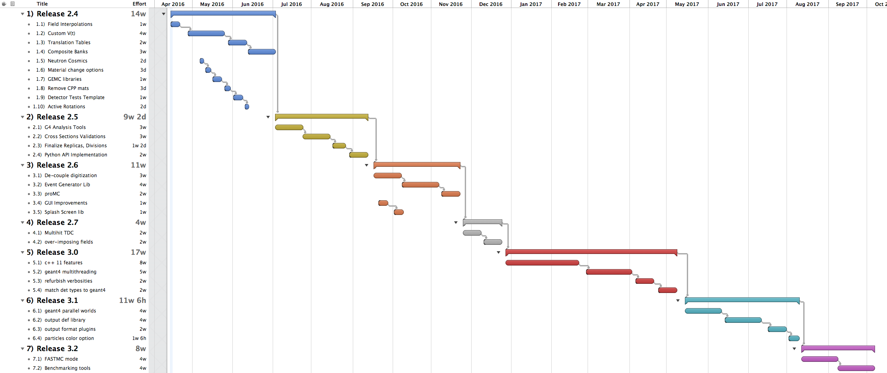

:orphan:

.. _roadmap:

############
GEMC Roadmap
############

GEMC 2.4
--------

- Using new geant4 10.2. ✅

- Magnetic Field interpolations.

- Linux Tarballs.

- **Custom V(t)**:
  Currently a Voltage vs time V(t) function is provided by gemc, based on a user parameterization
  and the Edep(t) geant4 steps.
  This does not take into account any signal treatment present in the digitization routines.

  The step by step digitization routine will produce an intensity vector and its time vector: I(t)
  The algorithms can be copied from the digitization routines.

  A V(t) function will be based on the I(t). The new V(t) will therefore take into account all detectors
  algorithms (attenuation lengths, smearling, pmt q.e. for example) and provide a signal that should be
  very close to what we see in real scopes.

- **Translation tables mechanism**: from detector identifier to crate/slot/channel.

- Output format will match the composite banks of the JLab data acquisition group.

- Option: by giving a volume name, change its material to a new material.

- Option: by giving a material name, change all volume with that material to a material.

- Neutrons cosmic ray model.

- Custom model for mu decay.

- Starting to move utility source code to **GEMC/libraries** github.

- Removing sensitivity option for a given detector.

- Test suite for individual detectors.

- remove more obsolete cpp materials.

- add physical volume constructor - active rotations.

GEMC 2.5
--------
- G4Analysis tool for all detectors fluxes.

- Physics Cross Section Validation at JLab regine. SAID tables, inclusive cross section.

- Finalize implementation of Replicas and Divisions.

- Python API implementation.

- Use Run Action.

GEMC 2.6
--------

- **Digitization routines will be plugins**, stored with the detector definitions (geometry, materials, etc)
  They will not be compiled in the gemc core anymore.

- GEMC library for event generation. This will include plugins for different formats.

- Support for **proMC** format for event generation.

- GUI improvements:
   - culling options combobox.
   - move timewindow to general generator tab - make all other the same.

- bring splash screen out of util - general library.

GEMC 2.7
--------

- overimposing magnetic fields

- Multihit TDC.

GEMC 3.0
--------

- 3.0 will start making use of **c++11** features.

- **geant4 multithreading**.

- re-define and document all verbosities.

- match detector types to geant4.

GEMC 3.1
--------

- geant4 **parallel worlds**.

- output format plugins.

- geant4 output definitions will be an external GEMC library.

- particles color map option.

GEMC 3.2
--------

- FASTMC mode. Simplified physics? Calorimeter parameterisation? Geant4 Bias?

- Benchmarking tools

