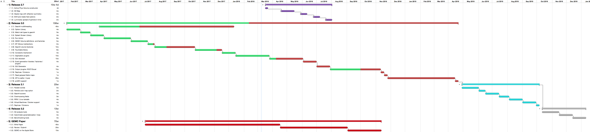

:orphan:

.. _roadmap:

############
GEMC Roadmap
############

GEMC 2.4 - June 2016 ✅
-----------------------

- Using new geant4 10.2. ✅

- Magnetic Field interpolations. ✅

- Field map attributes. ✅

- **Noise generator mechanism**: possibility to add custom noise/hot channels to detector response. ✅

- Option: by giving a volume name, change its material to a new material. ✅

- Option: by giving a material name, change all volume with that material to a material. ✅

- Neutrons cosmic ray model. ✅

- Option to force radiative decay of muons. ✅

- Remove sensitivity option. ✅

GEMC 2.5 - September 2016
-------------------------

- Gemc external Libraries ✅

- Remove more obsolete cpp materials.✅

- Accelerator Sync Bank ✅

- **Translation tables mechanism**: from detector identifier to crate/slot/channel. ✅

- gstring namespace library ✅

- **Custom V(t)**: ✅

    - A user-defined **chargeTime** routine produces charge and time information
      for each geant4 step ✅

    - A user-defined **voltage** function produces a voltage value for a given asked time ✅

- Output format to match the FADC composite banks of the JLab data acquisition group. ✅

- GDML factory ✅

- CAD factory ✅

GEMC 2.6 - Jun 2017
---------------------

- SKIPGEN option ✅

- Magnetic field info in MHit ✅

- Add Birk Constant. ✅

- Add Mirror Optical Smearing Alpha. ✅

- Fast MC mode and track smearing.

- Beagle event generator.

- Identifier to **touchable** library.

- GFLUX hittype to record photons.

- **G4Analysis Tools**.

- Cross Section Validation at JLab energies.

- Finalize implementation of Replicas and Divisions.

- Add / Remove axis in GUI

- Detectors Test Template.

- Add physical volume constructor - active rotations.

GEMC 2.7 - Aug 2017
-------------------

- Run Action and Digitization Constants

- **Digitization routines will be plugins**, stored with the detector definitions (geometry, materials, etc)
  - They will not be compiled in the gemc core anymore.
  - Constants mechanism will be handled in run action, no more in static call

GEMC 2.8 - Dec 2017
----------------------

- Event generation library. This will include plugins for different formats.

- Support for **proMC** format for event generation.

- Redesign Generator Tab

- Culling options combobox.

- Pop up window for detector description

GEMC 2.9 - Mar 2018
------------------------

- Multihit TDC

- **Python API** implementation.

- Read Gzipped field maps

- API to sqlite

- Virtual Machines for installation.

GEMC 3.0 - Sep 2018
--------------------

- gemc 3.0 will make use of many **c++11** features and optimization.

- Option library

- **Geant4 multithreading**.

- Re-define and document all verbosities.

- Match detector types to geant4.

- Splash Screen library

- Refurbish GUI

GEMC 3.1 - Feb 2019
------------------------

- Geant4 **parallel worlds**.

- Output library

- Output format plugins.

- Particles color map option.

- Geant4 scorers

- RPM / Linux Tarballs.

GEMC 3.2 - May 2019
------------------------

- FASTMC mode. Simplified physics? Calorimeter parameterisation? Geant4 Bias?

- Benchmarking tools

- G4Cout redirections

- GEMC Nim A Paper

GEMC 3.3 - Jul 2019
---------------------

- Overimposing magnetic fields

GEMC Paper - 2017 / 2019
------------------------

- Write Paper

- Review / Submit

- GEMC on the Apple Store

