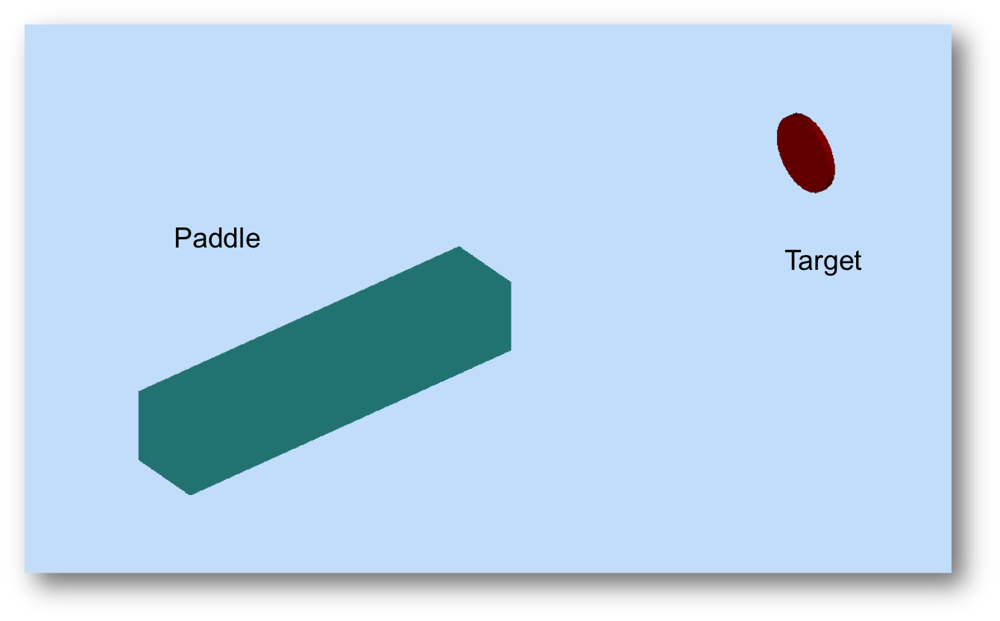
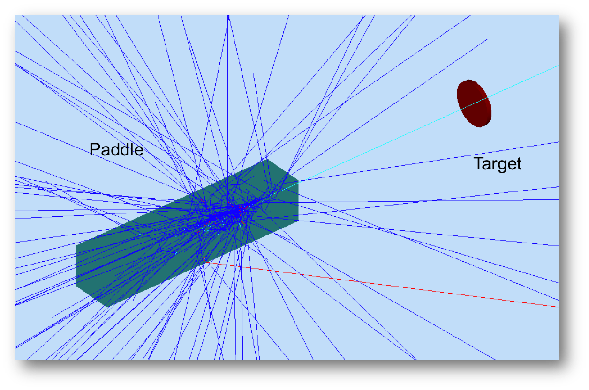

:orphan:

=======================
My First Volume - *4/5*
=======================

Running GEMC
------------

Let's see what you produced. Run gemc using the provided gcard::

 gemc example.gcard

You should see the "long" variation of the geometry:

Go ahead and hit the "Run" button to shoot a 1 GeV electron:

Next we'll change the paddle material.

|

.. image:: ../previous.png
	:target: 	myFirstp3.html
	:align: left

