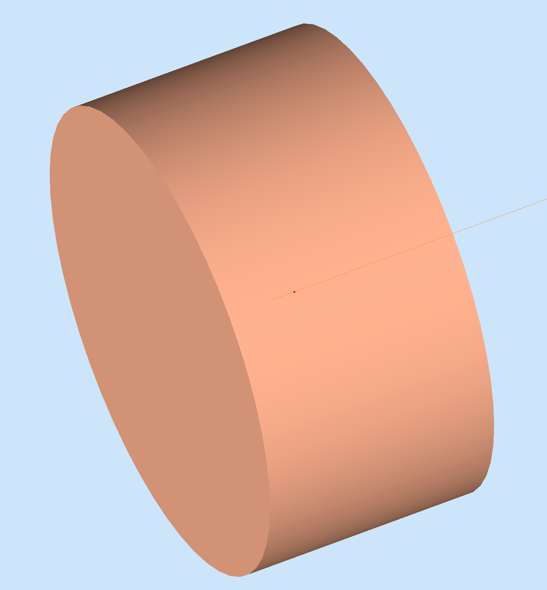

:orphan:

=======================
Simple Example  - *2/2*
=======================

Producing the geometry
^^^^^^^^^^^^^^^^^^^^^^

The geometry can be generated with the command::

 ./example.py config.dat

WARNING:  this will overwrite the original project text files.

The gcard
^^^^^^^^^

The example.gcard is the configuration file that gemc use to load detectors and simulation conditions.
Notice how the primary generator is set in the gcard::

<option name="BEAM_P" value="proton, 1.0*GeV, 180*deg, 0*deg"/>
<option name="BEAM_V" value="(0., 0., 0.0)cm"/>

And notice how the output file is also a gcard entry::

<option name="OUTPUT" value="txt, out.txt"/>

Running GEMC
^^^^^^^^^^^^

Run gemc using the provided gcard::

 gemc.command example.gcard

Go ahead and run one event. You should see a proton track as in the figure below:

|

.. image:: ../../previous.png
	:target: 	simple1p1.html
	:align: left

