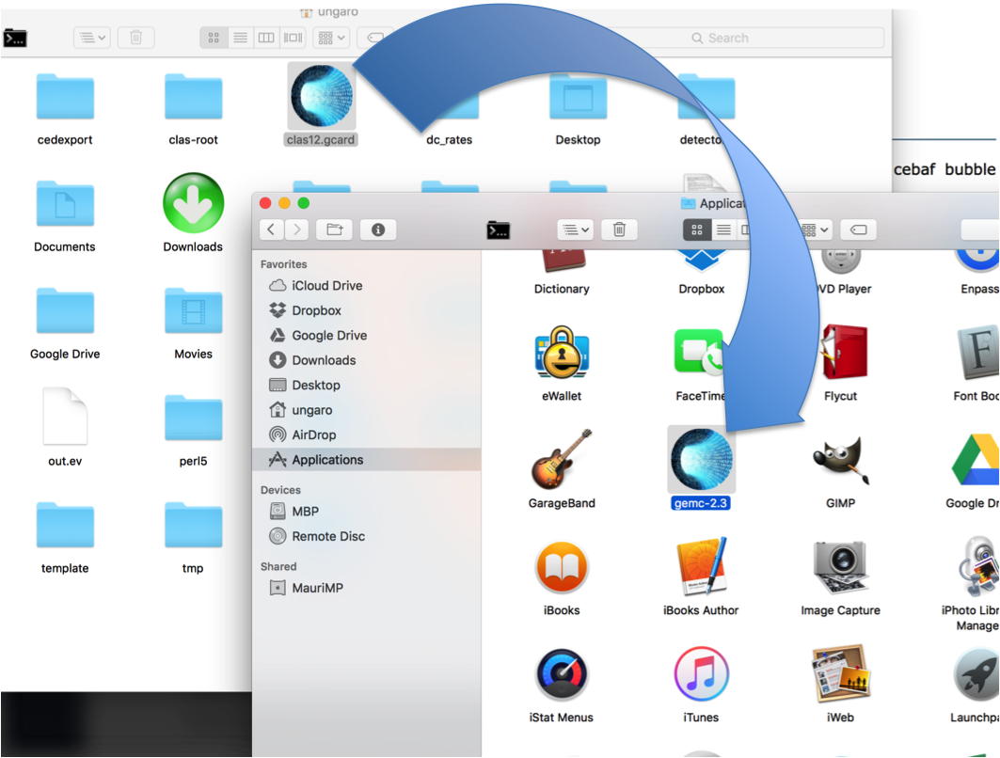

:orphan:

.. _downloads:

GEMC Dowloads
=============

.. |download2.4at10| image:: download-button.png
	:width: 110pt
	:target: http://jlab.org/12gev_phys/packages/dmg/gemc-2.4.dmg

.. |download2.3at10| image:: download-button.png
	:width: 110pt
	:target: http://jlab.org/12gev_phys/packages/dmg/gemc-2.3.dmg

+-----------------------------------------------------------------+
|          Mac OS app (DMG)                                       |
+--------------+------------------+----------+--------------------+
|   Version    |  OS Version      |   Size   |                    |
+--------------+------------------+----------+--------------------+
|   **2.4**    |    10.10 and up  |  484 MB  | |download2.4at10|  |
+--------------+------------------+----------+--------------------+
|   **2.3**    |    10.10 and up  |  478 MB  | |download2.3at10|  |
+--------------+------------------+----------+--------------------+

|

+-----------------------------------------------------------------+
|          Fedora Line                                            |
+--------------+------------------+----------+--------------------+
|   Version    |  OS Version      |   Size   |                    |
+--------------+------------------+----------+--------------------+
|     2.2      |    23            |          | coming soon!       |
+--------------+------------------+----------+--------------------+

|

+-----------------------------------------------------------------+
|          Ubuntu Line                                            |
+--------------+------------------+----------+--------------------+
|   Version    |  OS Version      |   Size   |                    |
+--------------+------------------+----------+--------------------+
|     2.2      |    14.04         |          | coming soon!       |
+--------------+------------------+----------+--------------------+

Geometry Downloads
------------------
`text factory experiment tarball <http://jlab.org/12gev_phys/packages/gcards/experiments.tar>`_.
Includes the clas12 detectors, the hps beamline, the cebaf bubble experiment, the bdx setup, beamline and detectors of the electron-ion colloider (eic).

Events:
-------
`10 Deep Inelastic Scattering events in LUND format <http://jlab.org/12gev_phys/packages/gcards/dis.dat>`_

GCards:
-------
`CLAS12 Experimental setup <http://jlab.org/12gev_phys/packages/gcards/clas12.php>`_

`HPS Experimental setup <http://jlab.org/12gev_phys/packages/gcards/hps.php>`_

Running the GEMC app on a mac
-----------------------------

You may have to allow to open apps from any developer to run gemc.

Using the gemc app icon:
^^^^^^^^^^^^^^^^^^^^^^^^

* Drag and drop a gcard on the GEMC icon in the application directory:

Using the command line
^^^^^^^^^^^^^^^^^^^^^^

You can use the gemc.command on a terminal to run gemc, using the typical options and gcard::

 /Applications/gemc-2.4.app/gemc.app/Contents/MacOs/gemc.command   *options* *gcard*

Where *version* is the gemc version you're using.

Magnetic Fields
---------------
Some experiment require magnetic field maps. For example, clas12 field maps are located here:

 * `solenoid <http://clasweb.jlab.org/12gev/field_maps/clas12SolenoidFieldMap.dat>`_
 * `torus <http://clasweb.jlab.org/12gev/field_maps/clas12TorusOriginalMap.dat>`_

In case of dmg installation, download and move the maps to:

gemc.app/Contents/Resources/

For example::

 mv ~/Downloads/clas12SolenoidFieldMap.dat.txt /Applications/gemc-2.4.app/gemc.app/Contents/Resources/

In case of installation from source code, unpack in::

 $JLAB_ROOT/noarch/data/

GEMC Release Notes
------------------
For release notes and the complete changelog see :ref:`release notes <releaseNotes>`.

