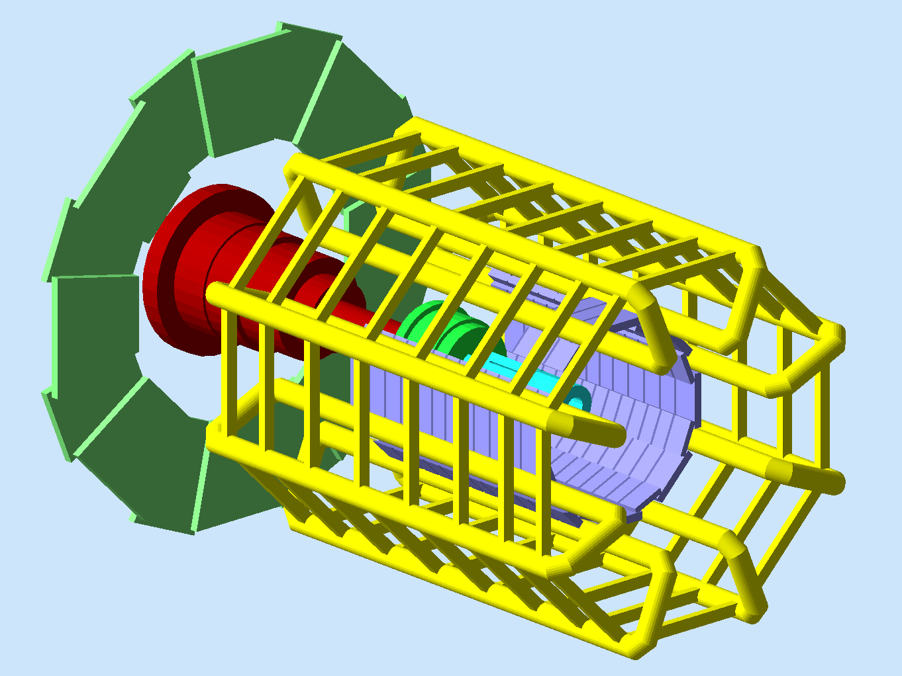

:orphan:

.. _exampleAtlas:

==============
Atlas from CAD
==============

In this example the USS Enterprise shoots protons torpedoes at a dragin.

Requirements
------------

- gemc 2.5 or newer
- `example tarball <https://gemc.jlab.org/gemc/html/documentation/tutorials/material/exampleAtlas.tar>`_

How to run
----------

1. Unpack the tarball in a directory of your choice::

    tar -xpvf exampleAtlas.tar

2. run gemc using the gcard provided::

    gemc atlas.gcard

3. use the camera tab to make cuts, select perspective view, etc.

