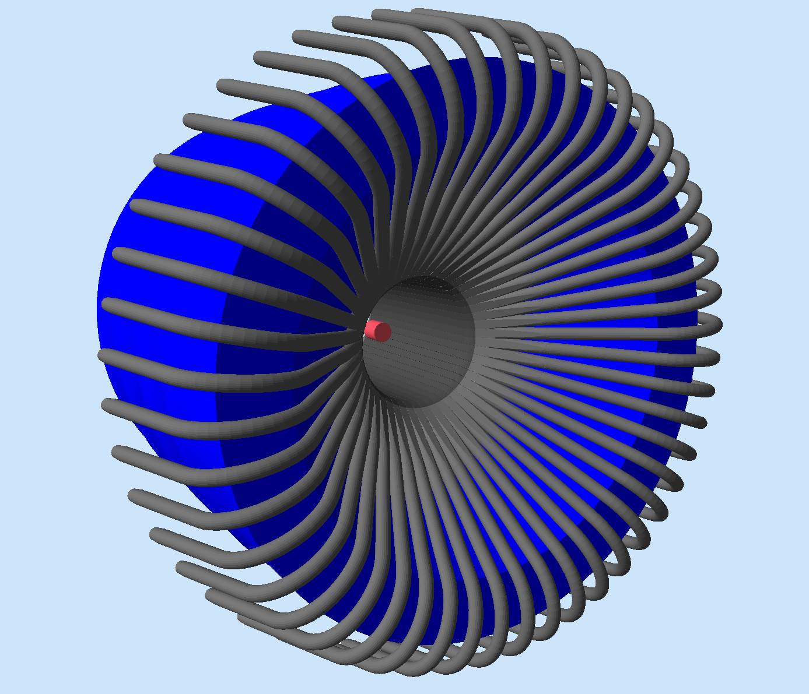

:orphan:

.. _ctofCade:

A time of flight detector from CAD
==================================

This example shows how to load a detector from CAD and associate to it attributes on the fly.

- make certain volumes sensitive
- associate volumes with a digitization routine.
- add visualization attributes to volumes
- set a material to volumes
- set the position of a volume
- set the rotation of a volume

A target and a solenoid are also added to the simulation with a TEXT factory: this examples shows how
to load different volumes using different factories.

Requirements
------------

- gemc 2.5 or newer
- `example tarball <https://gemc.jlab.org/gemc/html/documentation/tutorials/material/exampleCTOFCAD.tar>`_

How to run
----------

1. Unpack the tarball in a directory of your choice::

    tar -xpvf exampleCTOFCAD.tar

2. notice in the gcard how all cad files from a directory are loaded::

    <detector name="cad/" factory="CAD"/>

3. notice in "cad.gxml" how attributes are associated to cad files, including sensitivity and identifiers::

    <volume name="cad/sc28" color="444444" material="scintillator" position="0*mm 0*mm 1273.27*mm"
            rotation="0*deg 180*deg 0*deg" sensitivity="ctof" identifiers="paddle manual 28"/>

4. run gemc using the gcard provided:

    gemc ctof.gcard

5. Run some events and look at the signal GUI. You can select various quantities to display on screen.
   The digitization routine "ctof" (set in cad.gxml) is called for each sensitive paddle.

6. The CAD imports are:

   - 48 scintillators, with 132 facets each.
   - 48 lightguides, with 1330 facets each.

   For a total of 63,840 + 6,336 = 70,176 facets. Yet the simulation (both visualisation and event running) is lighting fast.
   In fact it is only ~5% slower than the much simpler setup described :ref:`here <simplePaddleExample>`.

|

.. raw:: html

   
   

   
<small> <i> Example of a scintillator (left) and light-guide (right) cad files used in this example.
   </i></small><c/enter>  
