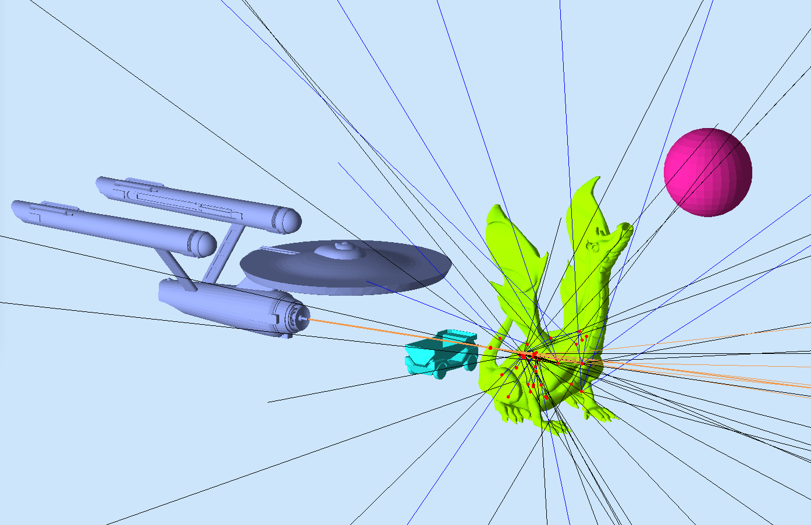

:orphan:

.. _exampleForFun:

==========
Sci-Fi War
==========

In this example the USS Enterprise shoots protons torpedoes at a dragin.

Requirements
------------

- gemc 2.5 or newer (september 2016)
- `example tarball <https://gemc.jlab.org/gemc/html/documentation/tutorials/material/forFun.tar>`_

How to run
----------

1. Unpack the tarball in a directory of your choice::

    tar -xpvf exampleforFun.tar

2. run gemc using the gcard provided::

    gemc fun.gcard

3. use the Camera GUI to make cuts, select perspective view, etc.

4. use the Generator GUI to select the type of "torpedoes" (primary particle) and their number. Shoot the torpedoes at the dragon!

5. checkout how much energy was released on the dragon

