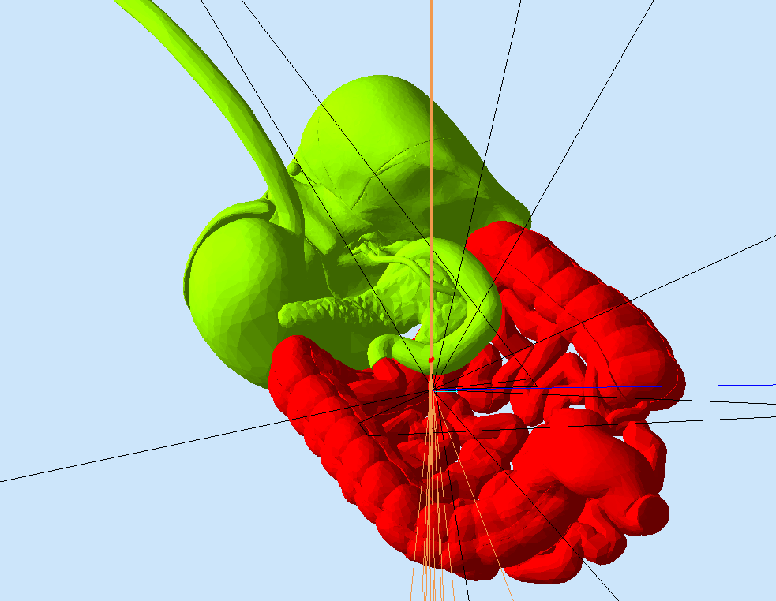

:orphan:

.. _exampleHumanBody:

==============
The Human Body
==============

In this example the following organs are imported from CAD:

- heart section
- brain section
- upper and lower gastrointestinal

Requirements
------------

- gemc 2.5 or newer (september 2016, currently "devel")
- `example tarball <https://gemc.jlab.org/gemc/html/documentation/tutorials/material/examplehumanBody.tar>`_

How to run
----------

1. Unpack the tarball in a directory of your choice::

    tar -xpvf examplehumanBody.tar

2. run gemc using the gcard provided::

    gemc hb.gcard

3. use the Camera GUI to make cuts, select perspective view, etc.

4. check the Signals GUI to see how much energy the proton released

5. you can change the materials of the volumes in the file cad.gxml

