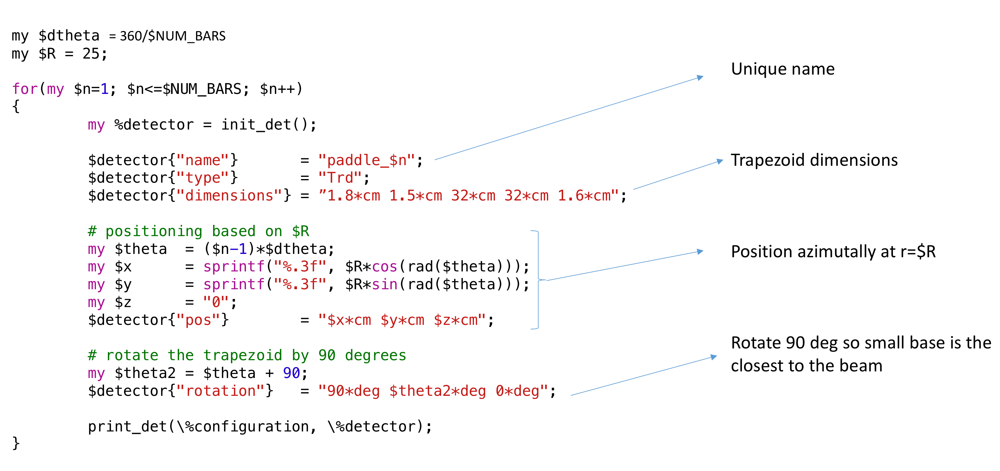

:orphan:

.. _simplePaddleExample:

Paddles Example
===============

This example shows how to build a Time Of Flight Scintillator array around the beam.
The scintillators are trapezoids.
The base closest to the beam is smaller than the one further away to ensure full azimuthal coverage.

Notice how a fairly complex geometry can be realized with so few lines a code. Users can focus on the
geometry dimensions and positions and do not need to know the geant4 details.

.. image:: paddlesDet.png
	:width: 98%
	:align: center

