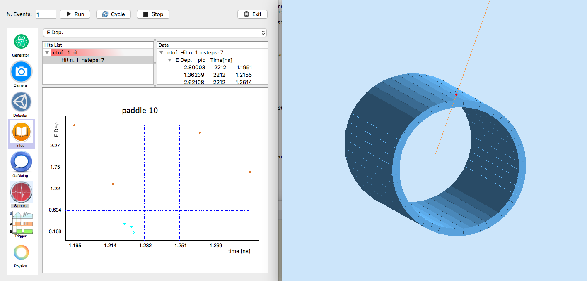

:orphan:

.. _simplePaddleExample:

Paddles Example
===============

This example shows how to build a Time Of Flight Scintillator array in a barrel configuration with few lines a code.
The scintillators are trapezoids: the base closest to the beam is smaller than the one further away to ensure full azimuthal coverage.

Notice in geometry.pl how users can focus on the geometry dimensions and positions and do not need to know c++ or geant4.

Requirements
------------

- gemc 2.4 or newer
- `example tarball <https://gemc.jlab.org/gemc/html/documentation/tutorials/material/exampleCentralTOF.tar>`_

How to run
----------

1. Unpack the tarball in a directory of your choice::

    tar -xpvf exampleCentralTOF.tar

2. Run the script to build the geometry, material, and define hit and banks::

    ./ctof.pl config.dat

3. run gemc using the gcard provided:

    gemc ctof.gcard

4. Run some events and look at the signal GUI. You can select various quantities to display on screen.

