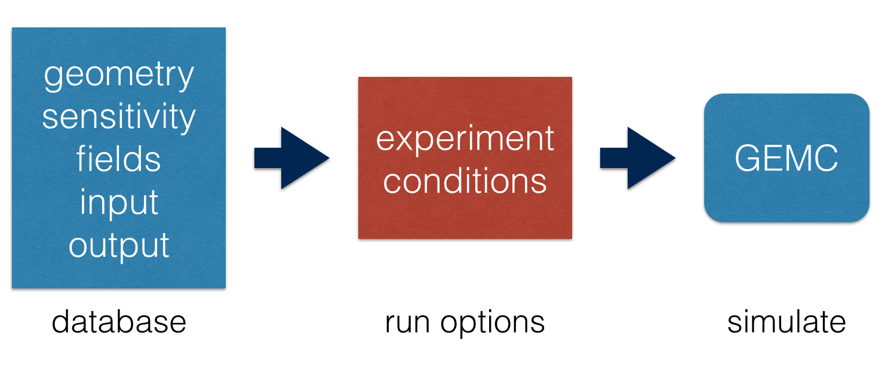

.. test documentation master file, created by
   sphinx-quickstart on Tue Dec 15 08:52:12 2015.
   You can adapt this file completely to your liking, but it should at least
   contain the root `toctree` directive.

GEant4 Monte-Carlo
==================

gemc is an application based on `geant4 <https://geant4.cern.ch>`_  to simulate the passage of
particles through matter.
The user parameters (geometry, materials, fields, etc) are stored in databases.

|

.. container:: mydiv

	.. thumbnail:: beam.png
		:width: 20%
		:group: mycenter
		:title:

		A 5T solenoid field aligns the beam of electrons along the z-axis.
		An addition tugnsten cone (blue) provides additional shielding to the
		CLAS12 detector from the beam high current. The GEMC simulation was used to design
		and validate the shielding.

	.. thumbnail:: clas12.png
		:width: 20%
		:group: mycenter
		:title:

		A Deep Virtual Compton Scattering (DVCS) event in the CLAS12 Central Detector.

	.. thumbnail:: eic.png
		:width: 20%
		:group: mycenter
		:title:

		The GEMC simulation of the Electron Ion Collider beamline and detectors.

	.. thumbnail:: bubble.png
		:width: 20%
		:group: mycenter	
		:title:

		10,000 electrons producing photons in the 6mm collimator in the bubble experiments at
 		Jefferson Lab.

Overview
========

gemc tries to make easy things easy and hard things possible.

Users can build a simulation with a few lines of code, with no required knowledge
of C++ or geant4 even for the most complex setups: the
definition of geometry, materials, output banks, etc is done by filling the relevant
information in the gemc API scripts.

The upload to databases (available: MYSQL or ASCII) is automatic.
GEMC can then read the databases and run the geant4 library.

At run time, options can be given to tilt objects, set conditions, etc.

Any change in the setup is reflected in the databses and can be tested immediately, anywhere, by all gemc users w/o having
to re-compile code. In fact, the same gemc executable is used for several  experiments.

Open source
===========
Please visit the contributing page for information on how to contribute to gemc.
If you have any bug/code optimization to report, new ideas, features request, please head
over github to open an issue.

..
 Citing gemc
 ===========

