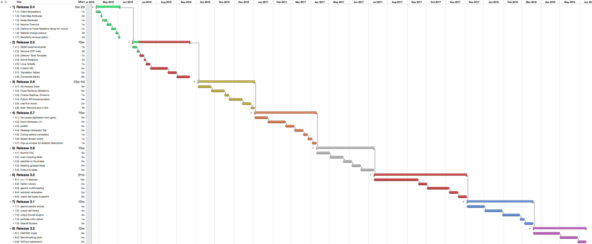

.. test documentation master file, created by
   sphinx-quickstart on Tue Dec 15 08:52:12 2015.
   You can adapt this file completely to your liking, but it should at least
   contain the root `toctree` directive.

GEant4 Monte-Carlo
==================

gemc is an application based on `geant4 <https://geant4.cern.ch>`_  to simulate the passage of
particles through matter.
The main features of gemc are:

 * user parameters stored in databases.
 * easy interface to build simulations.

|

.. container:: mydiv

	.. thumbnail:: beam.png
		:width: 20%
		:group: mycenter
		:title:

		A 5T solenoid field aligns the beam of electrons along the z-axis.
		An addition tugnsten cone (blue) provides additional shielding to the
		CLAS12 detector from the beam high current. The gemc simulation was used to design
		and validate the shielding.

	.. thumbnail:: clas12.png
		:width: 20%
		:group: mycenter
		:title:

		A Deep Virtual Compton Scattering (DVCS) event in the CLAS12 Central Detector.

	.. thumbnail:: eic.png
		:width: 20%
		:group: mycenter
		:title:

		The gemc simulation of the Electron Ion Collider beamline and detectors.

	.. thumbnail:: bubble.png
		:width: 20%
		:group: mycenter	
		:title:

		10,000 electrons producing photons in the 6mm collimator in the bubble experiments at
 		Jefferson Lab.

Overview
========

gemc tries to make easy things easy and hard things possible.

Users can build and run complex setups even with no C++ or geant4 knowledge.

The upload/download of the parameters to/from databases (available: MYSQL or ASCII) is automatic.

|

|

Changes in the setup are reflected in the databases and can be tested in real time
by all users w/o having to re-compile code.

Open source
===========
Please visit the :ref:`contributing to gemc <contributingToGemc>` page if you're interested in the code development.

If you have any bug/code optimization to report, new ideas, features request, 
please feel free to `open a code issue <https://github.com/gemc/source/issues/new>`_ in github.

..
 Citing gemc
 ===========

