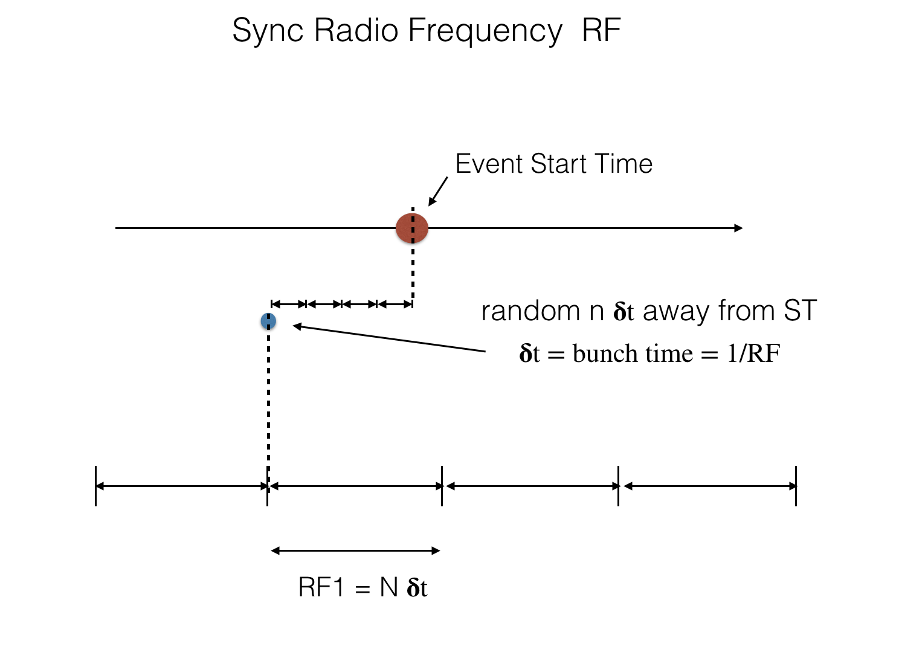

:orphan:

.. _frequencySyncSignal:

################################
Frequency Synchronization Signal
################################

In many experiments a beam is accelerated and used to produce physics reactions.

The accelerator provide timing signature of the beam, in the form of radio-frequency RF: the beam is grouped in bunches, distant :math:`\delta t = 1/RF` from each other.

The radio-frequancy signature is recorded typically every fixed number of bunchers, :math:`N_{RF}`.

Sync signal
-----------

A sync signal is generated a random number N of bunches away from the event start time.
The signal is repeated forward and backward in time, every :math:`N_{RF}\delta t` seconds, until the
event electronic time window is filled.

The situation is explained in the figure below.

An arbitrary number of sync signal can be generated by givin their time distance away from each other.

|
Sync signal control
-------------------

The option **RFSETUP** is used to control the sync signal.
For example, to set the accelerator radio frequency to 500MHz (0.5 GHz) and produce two RF signal,
30 bunches (60ns) away from each other, each producing a signal every 40 bunches (80 ns)::

  -RFSETUP="0.5, 40, 30"

|
Vertex Correction
-----------------

The time seen by the detectors and the RF signal can be compared to improve the overall timing resolution: the event start time has to match one of the beam buches time.
If the target has some non negligible length one has to take into account the time difference of the event start time and the propagation time to the vertex origin.

This can be taken care of with the **RFSTART** option, which can accept two values::

 - "eventVertex, 0, 0, 0" (default): the RF time is the event start time +
    the light time-distance of the first particle from the point (0,0,0)
 - "eventTime".....................: the RF time is identical to the event start time

|
Examples of beam setup
----------------------

CLAS12 detectors and the Jefferson Lab accelerator CEBAF
^^^^^^^^^^^^^^^^^^^^^^^^^^^^^^^^^^^^^^^^^^^^^^^^^^^^^^^^

  The radiofrequency is 499 MHz. The RFs are 40 bunches apart (160.32ns). The distance between 2 RF signals is 20 bunches.
  The proper options are::

   -RFSETUP="0.499, 40, 20"

  The default **RFSTART** can be used.
